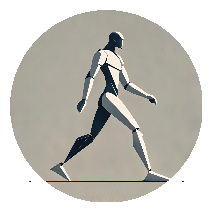

<div align="center">
    
</div>

<h1>Base Locomotion</h1>

Base Locomotion is a fully network-replicated system designed to provide robust and smooth character movement mechanics. This project focuses on creating a polished base for locomotion that can be extended for various game genres, ensuring seamless multiplayer compatibility.

[Video Preview](https://youtu.be/iSDiAaonTII)

## Features

- **Starts/Stops**: Smooth transitions when starting or stopping movement.
- **Procedural Lean**: Dynamically generated leaning animations for a more natural feel.
- **Velocity/Looking/Aiming Direction Movement**: Supports movement relative to velocity, looking direction, and aiming direction for precise control.
- **Stand <-> Crouch Transitions**: Smooth transitions between standing and crouching states.
- **Turn in Place**: Responsive and fluid turning animations for stationary characters.
- **In-Air State**: Comprehensive handling of movement and animations while in the air.
- **Male/Female Variants**: Separate animation sets for male and female characters to enhance realism.
- **Multi-Threaded Animation Updates**: Optimized animation updates using multi-threading for improved performance.

## Installation

1. Clone the repository:
   ```bash
   git clone https://github.com/the-mixtape/BaseLocomotion.git
   ```

2. Open the project in your game engine (e.g., Unreal Engine 5.5).

## Usage

- The system is designed to be easily customizable. 
- You can extend the existing features or replace animations to suit your specific needs.
- Fully optimized for multiplayer games with network replication.

## Contributing

Feel free to contribute by submitting issues or creating pull requests. Any feedback is highly appreciated!

## License

This project is released under the MIT License. See the `LICENSE` file for more details.

---

Start building your next game with a solid base for character movement!